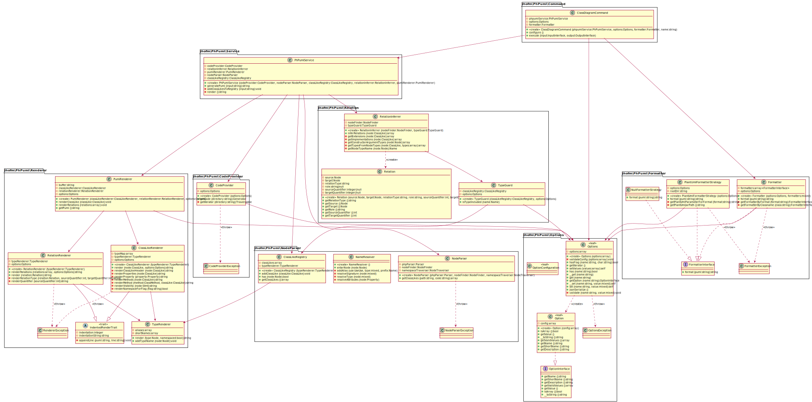

# PhPuml

## About PhPuml

PhPuml is a console tool that creates PlantUML class diagram definitions (`*.puml`) from PHP code, written in PHP.

Here's a class diagram of the tool, created by itself:



And the [generated puml file](./doc/src/ph-puml.puml) the diagram is based on.

## Features

 * Convenient installation via composer
 * Packages from Namespaces
 * Generates inheritance relationships for classes, interfaces and traits
 * Generates class properties & method signatures, including type hints from @var doc comments
 * Dependencies are inferred from constructor argument types (assumes dependency injection)
 * Associations are inferred from "new" expressions (\<\<creates\>\>) and "throw" statements (\<\<throws\>\>)   
 * Works on Linux (tested), Windows (tested), macOS (probably)

## Requirements

 * PHP 7.4 only for now
 * Composer 2

## Installation

The preferred way to install PhPuml is globally through composer.

```console
$ composer global require jhofm/ph-puml
```

If you already have composer's global vendor/bin folder in your PATH, PhPuml can be executed by calling the script ```ph-puml```.
Otherwise the executable can be found at ``~/.composer/vendor/bin/ph-puml``.

Alternatively you can also install PhPuml as a composer project.

```console
$ composer create-project jhofm/ph-puml
$ ./bin/ph-puml
```

Or clone this repository and install the composer dependencies yourself.

```console
$ git clone git@github.com:jhofm/ph-puml.git
$ cd ph-puml
$ composer install
$ ./bin/ph-puml
```  

## Quick Start

The `ph-puml` script will output PlantUML code describing all PHP files found in the current 
folder. 

```bash
$ cd mycode/src
$ ph-puml 
```

Alternatively it accepts a relative or absolute path to a target directory or file as an argument.

```bash
$ ph-puml mycode/src
```

The resulting PlantUML code is written to the console's standard output and can of course be piped into a file instead.

```bash
$ ph-puml > class.puml
```

If the target path is a directory, PhPuml will determine the code files to analyze using a set of inclusion and exclusion rules.
By default, files in the directory tree with the file extension `.php` are included, as long as none of their parent folders are called `vendor`.
 
You can override the filter rules with command line options. All rules are regular expressions. You can use several at the same time.
For example the following command will NOT skip files from `vendor` folders, and analyze files in the `includes` folder with the file extension `.inc` as well.  
```console
$ ph-puml --exclude --include "/\.php$/" --include "/^includes/.*\.inc$/"
```

The command will fail when attempting to parse files that do not contain valid PHP code.
   
PhPuml uses `symfony/command`, so a help page including all supported arguments and options is available.   

```console
$ ph-puml -h
```

## Limitations

* Auto generated class diagrams will probably never exactly meet your needs, but provide a starting point for manual refinement (and save mind-numbing work).
* PhPuml is able to handle huge amounts of code files, but limiting diagrams to as few classes as needed is always good idea.
* Cleaner code will yield better results. Type hints and Namespaces help a whole lot, for example.
* There's a lot of polishing still to be done, like inferring additional relation types or providing more customisations. 

## Troubleshooting

* `Uncaught Error: Class Composer\InstalledVersions not found`: PhPuml requires Composer 2
* `require(): Failed opening required ...`: Run composer install 

## Acknowledgements

This would have been exponentially more difficult to do without [Nikita Popov](https://github.com/nikic)'s [PHP-Parser](https://github.com/nikic/PHP-Parser),
so many thanks for that. [Symfony](https://github.com/symfony) helped a lot, too. 
Basically every dependency i use is maintained by kings, queens and total legends. <3  
